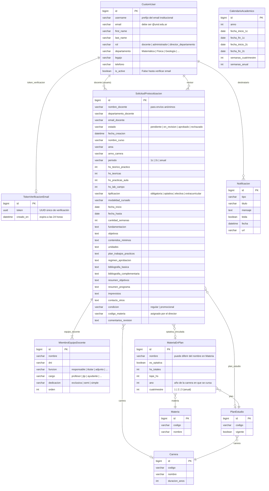

# Sistema de Gestión Académica Docente

Plataforma web para la gestión de solicitudes de protocolización de programas de cursos optativos y curriculares de la Facultad de Ciencias Físico Matemáticas y Naturales — Universidad Nacional de San Luis.

## Módulos

| Módulo | Descripción |
|--------|-------------|
| **Solicitudes** | Solicitud de protocolización de cursos: programa completo, equipo docente, carga horaria y bibliografía |
| **Trámites** | Base común: estados (Pendiente → En Revisión → Aprobado/Rechazado), revisión con comentarios, calendario académico |
| **Notificaciones** | Notificaciones internas para cambios de estado y nuevas solicitudes |
| **Accounts** | Autenticación, registro con verificación por email, roles y gestión de usuarios |

## Roles

| Rol | Permisos |
|-----|----------|
| **Docente** | Carga y consulta sus propias solicitudes. Descarga el documento completo (nota + programa) |
| **Director de Departamento** | Ve todas las solicitudes de su departamento, asigna código de materia, descarga nota de comisión |
| **Administrador** | Acceso total: ve todo, revisa, aprueba/rechaza, gestiona usuarios |

## Stack

- **Backend:** Python 3.10+ / Django
- **Base de datos:** PostgreSQL
- **Frontend:** Bootstrap 5 + Bootstrap Icons
- **Documentos:** ReportLab (PDF), python-docx (DOCX)
- **Email:** SMTP via Gmail con App Password
- **Config:** python-decouple (`.env`)

---

## Instalación

### Requisitos

- Python 3.10+
- PostgreSQL

### Pasos

```bash
# 1. Clonar repositorio
git clone https://github.com/marcopuliti/Sistema-Gestion-Academica-Docente.git
cd Sistema-Gestion-Academica-Docente

# 2. Entorno virtual
python -m venv venv
source venv/bin/activate        # Linux/Mac
venv\Scripts\activate           # Windows

# 3. Dependencias
pip install -r requirements.txt

# 4. Variables de entorno
cp .env.example .env
# Editar .env con credenciales de base de datos y email

# 5. Migraciones
python manage.py migrate

# 6. Datos iniciales (carreras, planes, materias, calendario)
python manage.py loaddata datos.json

# 7. Superusuario administrador
python manage.py createsuperuser

# 8. Directores de departamento
python manage.py crear_directores_departamento

# 9. Servidor de desarrollo
python manage.py runserver
```

Abrir en `http://127.0.0.1:8000`

---

## Variables de entorno

Ver [.env.example](.env.example).

| Variable | Descripción |
|----------|-------------|
| `SECRET_KEY` | Clave secreta de Django |
| `DEBUG` | `True` en desarrollo, `False` en producción |
| `DB_NAME` | Nombre de la base de datos |
| `DB_USER` | Usuario de PostgreSQL |
| `DB_PASSWORD` | Contraseña de PostgreSQL |
| `DB_HOST` | Host (default: `localhost`) |
| `DB_PORT` | Puerto (default: `5432`) |
| `EMAIL_HOST` | Servidor SMTP (default: `smtp.gmail.com`) |
| `EMAIL_PORT` | Puerto SMTP (default: `587`) |
| `EMAIL_USE_TLS` | `True` para TLS |
| `EMAIL_HOST_USER` | Cuenta Gmail remitente |
| `EMAIL_HOST_PASSWORD` | App Password de Google (no la contraseña de la cuenta) |
| `DEFAULT_FROM_EMAIL` | Nombre y dirección que aparece en los emails enviados |

### Configurar App Password de Gmail

1. Activar verificación en dos pasos en la cuenta Google
2. Ir a **Cuenta de Google → Seguridad → Contraseñas de aplicaciones**
3. Generar una contraseña para "Correo / Windows" (o cualquier nombre)
4. Usar esa contraseña de 16 caracteres en `EMAIL_HOST_PASSWORD`

> Solo se envían emails a dominios `@unsl.edu.ar`. Correos a otros dominios se omiten silenciosamente.

---

## Registro y verificación de cuentas

Los docentes se registran desde `/cuentas/registro/` con su email institucional `@unsl.edu.ar`. El sistema:

1. Crea la cuenta con `is_active=False`
2. Genera un token UUID con validez de 24 horas
3. Envía un email de verificación al `@unsl.edu.ar` del docente
4. Al hacer clic en el enlace, activa la cuenta (`is_active=True`)

Hasta verificar, el login muestra un mensaje específico indicando que debe verificarse el email.

El username se genera automáticamente a partir del prefijo del email (ej: `juan.perez@unsl.edu.ar` → username `juan.perez`). Si ya existe, se agrega un número correlativo.

---

## Directores de Departamento

Hay un usuario director por cada uno de los 6 departamentos de la facultad.

### Crear en nuevo despliegue

```bash
python manage.py crear_directores_departamento
```

Crea los siguientes usuarios con **contraseña inicial = username**:

| Username | Departamento |
|----------|-------------|
| `matematica` | Matemática |
| `fisica` | Física |
| `geologia` | Geología |
| `electronica` | Electrónica |
| `informatica` | Informática |
| `mineria` | Minería |

Cambiar contraseñas en el primer acceso:

```bash
python manage.py changepassword matematica
# (repetir para cada director)
```

O desde el panel de administración Django en `/admin/`.

El comando es idempotente: si los usuarios ya existen, los omite sin error.

---

## Documentos generados

Desde el detalle de cada solicitud se pueden descargar:

| Documento | Quién puede descargar | Formato |
|-----------|----------------------|---------|
| **Solicitud Completa** (nota de elevación + programa) | Todos los usuarios con acceso a la solicitud | PDF / DOCX |
| **Nota de Comisión** (para el Secretario Académico) | Solo Director de Departamento y Administrador | PDF / DOCX |

La **Solicitud Completa** combina en un único archivo:
- **Página 1:** Nota de solicitud de protocolización dirigida al Secretario Académico
- **Páginas siguientes:** Programa completo con todas las secciones (oferta académica, equipo docente, características del curso, fundamentación, objetivos, contenidos, etc.)

---

## Datos iniciales (`datos.json`)

Incluye los datos base del sistema listos para importar:

| Tabla | Contenido |
|-------|-----------|
| `planes.carrera` | Carreras de la facultad |
| `planes.planestudio` | Planes de estudio por carrera |
| `planes.materia` | Materias del catálogo |
| `planes.materiaenplan` | Materias por plan con año, cuatrimestre y carga horaria |
| `tramites.calendarioacademico` | Calendario académico inicial |

> Las cuentas de usuario **no** están incluidas. Crearlas con los comandos de instalación.

Para regenerar el archivo desde una instalación existente (sin usuarios):

```bash
python manage.py dumpdata --natural-foreign --natural-primary \
  -e contenttypes -e auth.Permission \
  -e accounts.customuser -e admin.logentry -e sessions.session \
  --indent 2 > datos.json
```

---

## Flujo de estados de solicitudes

```
Pendiente → En Revisión → Aprobado
                       ↘ Rechazado
```

Al cambiar estado, el docente recibe una notificación interna. Al crear una solicitud, el Director del departamento correspondiente también recibe notificación.

---

## Diagrama de base de datos

> Renderizable en GitHub, [Mermaid Live](https://mermaid.live) o VSCode con la extensión *Markdown Preview Mermaid Support*.



---

## Estructura del proyecto

```
├── apps/
│   ├── accounts/            # Usuarios, roles, registro, verificación de email
│   │   └── management/
│   │       └── commands/
│   │           └── crear_directores_departamento.py
│   ├── tramites/            # Base común (estados, calendario, dashboard)
│   ├── solicitudes/         # Solicitud de protocolización + generación de documentos
│   │   ├── pdf.py           # Generación PDF (programa, nota comisión, solicitud completa)
│   │   └── docx_gen.py      # Generación DOCX (ídem)
│   ├── planes/              # Carreras, planes de estudio, materias
│   └── notifications/       # Notificaciones internas
├── config/                  # Settings, URLs, WSGI
├── templates/               # Templates HTML
├── static/                  # Archivos estáticos (incluye escudo.gif para documentos)
├── datos.json               # Fixture de datos iniciales
└── .env.example             # Ejemplo de configuración
```
