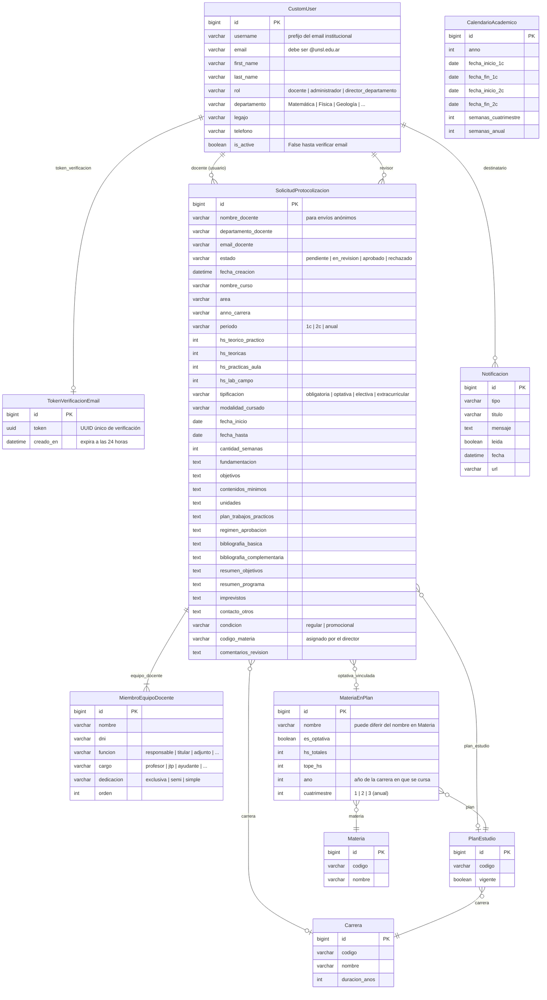

# Diagrama de Base de Datos

> Generado a partir de los modelos Django del proyecto.  
> Se puede visualizar en GitHub, [Mermaid Live](https://mermaid.live) o con la extensión **Markdown Preview Mermaid Support** en VSCode.

